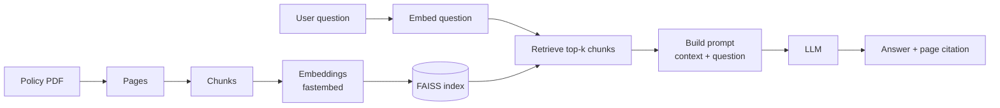
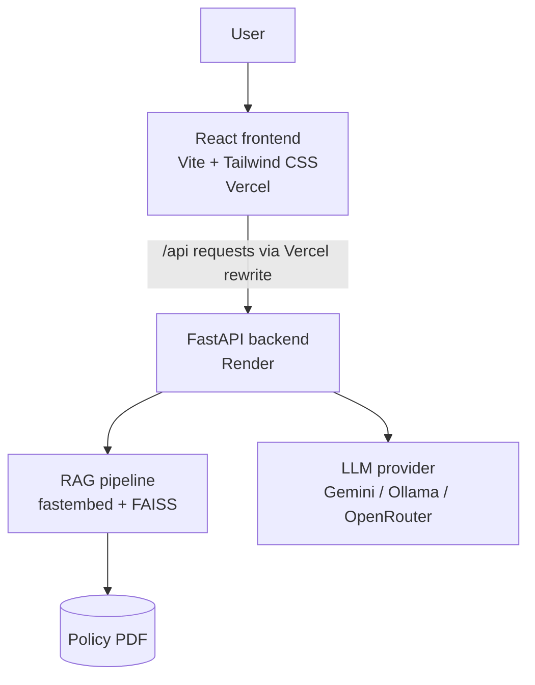

# RedLine Express: Bus Ticket Help Bot


An AI-powered support assistant that answers bus ticket questions using only the official policy document. It applies Retrieval-Augmented Generation (RAG) so every answer is grounded in the policy text, with a page-level source citation, instead of relying on the language model's general knowledge.

**Live demo:**  [https://redline-express-frontend.onrender.com/](url)

> RedLine Express, its policy and its contact details are fictional and exist for demonstration purposes only.

---

## Overview

Customers often struggle to find answers about cancellations, refunds and travel rules buried in long policy pages. RedLine Express lets them ask in plain language and get a short, accurate answer with a reference to the exact policy page it came from.

When the policy does not cover a question, the assistant says so and directs the user to customer support. It does not guess refund amounts, charges or timings.

## Key Features

- **Policy-grounded answers.** Responses are generated only from retrieved policy content.
- **Source citations.** Each answer includes a reference such as "From policy page 2", with the supporting passage available on demand.
- **Automatic policy loading.** The policy PDF loads on startup, so end users never upload anything.
- **Admin policy update.** An "Update policy" control lets an administrator replace the PDF.
- **Guided experience.** Topic cards and quick-question chips help users get started.
- **Safe fallback.** Unsupported questions return a clear "not found" message with a support referral.
- **Responsive interface.** A red-and-white help-center design with an animated bus illustration.
- **Swappable LLM providers.** Gemini, Ollama and OpenRouter are supported through configuration.

## Supported Topics

| Area | Examples |
|---|---|
| Cancellation and refunds | Cancellation charges by time slab, refund timelines |
| Rescheduling | Changing the travel date, name changes |
| Boarding | Changing the boarding point, reporting time |
| Luggage | Weight limits, prohibited items |
| Payments | Failed payments, money deducted without a ticket |
| Disruptions | Bus cancellations and delays |

## How It Works



1. The policy PDF is read page by page and split into overlapping chunks.
2. `fastembed` converts each chunk into a vector, and FAISS indexes the vectors.
3. A user question is embedded and matched against the index to find the most relevant chunks.
4. The retrieved chunks and the question are sent to the language model with instructions to answer only from that context.
5. The interface displays the answer together with the policy pages it relied on.

## Architecture



Frontend requests to `/api/...` are routed by Vercel to the Render backend, so the application code uses the same relative paths locally and in production.

## Tech Stack

| Layer | Technology |
|---|---|
| Frontend | React, Vite, Tailwind CSS, lucide-react |
| Backend | Python, FastAPI, Uvicorn |
| Retrieval | FAISS, fastembed (`BAAI/bge-small-en-v1.5`), pypdf |
| Language model | Gemini (default), Ollama, OpenRouter |
| Hosting | Vercel (frontend), Render (backend) |

## Project Structure

```text
RedLine-Express/
├── backend/
│   ├── app/
│   │   ├── main.py        # API routes
│   │   ├── rag.py         # RAG pipeline: chunking, indexing, retrieval, prompt
│   │   ├── llm.py         # LLM provider integration
│   │   └── config.py      # Settings loaded from environment
│   ├── requirements.txt
│   └── .env.example
├── frontend/
│   ├── public/            # Policy PDF served to the app
│   ├── src/
│   │   ├── components/    # Chat, BusArt, UI components
│   │   ├── lib/           # API client
│   │   ├── App.jsx
│   │   └── index.css
│   ├── package.json
│   ├── vite.config.js
│   └── vercel.json
├── tools/
├── vercel.json
└── README.md
```

## Getting Started

### Prerequisites

- Python 3.10 or later
- Node.js 18 or later
- An API key for your chosen LLM provider (for example, a Gemini API key)

### 1. Clone the repository

```bash
git clone https://github.com/swethakannan595-crypto/RedLine-Express.git
cd RedLine-Express
git checkout deploy
```

### 2. Run the backend

```bash
cd backend
pip install -r requirements.txt
```

Create your environment file:

```bash
# macOS / Linux
cp .env.example .env

# Windows
copy .env.example .env
```

Add your API key and settings to `.env` (see [Configuration](#configuration)), then start the server:

```bash
uvicorn app.main:app --reload --port 8000
```

| Endpoint | URL |
|---|---|
| API | http://127.0.0.1:8000 |
| Interactive docs | http://127.0.0.1:8000/docs |
| Health check | http://127.0.0.1:8000/api/health |

### 3. Run the frontend

In a second terminal:

```bash
cd frontend
npm install
npm run dev
```

Open http://localhost:5173. The app loads the policy PDF automatically and is ready for questions.

## Configuration

The backend reads its settings from `backend/.env`.

| Variable | Purpose | Example |
|---|---|---|
| `LLM_PROVIDER` | Which model provider to use | `gemini` |
| `GEMINI_API_KEY` | Provider API key | `your_api_key` |
| `GEMINI_MODEL` | Model name | `your_model_name` |
| `CHUNK_SIZE` | Characters per chunk | `800` |
| `CHUNK_OVERLAP` | Characters shared between chunks | `150` |
| `TOP_K` | Chunks retrieved per question | `4` |

> Never commit `.env` files or API keys. Store secrets in your hosting provider's environment settings.

## Deployment

| Component | Platform | Notes |
|---|---|---|
| Frontend | Vercel | Built from the `frontend` directory |
| Backend | Render | Runs `uvicorn app.main:app` and holds the API key as an environment variable |
| Routing | Vercel rewrites | Forwards `/api/*` to the Render service |

## Example Questions

- What is the cancellation charge?
- How long does a refund take?
- Can I change my travel date?
- Can I change my boarding point?
- What are the luggage restrictions?
- My payment failed. What should I do?
- What happens if my bus is delayed or cancelled?

## Design Principles

- **Grounded by default.** The model is instructed to answer only from retrieved context.
- **Transparent.** Users can see which policy page an answer came from.
- **Fail safe.** Missing information produces a clear referral to customer support, not a guess.
- **Configurable.** Chunking, retrieval depth and the model provider are set through environment variables.

## Roadmap

- Multi-document policy support
- Conversation memory for follow-up questions
- Multilingual answers
- Feedback buttons to rate answer quality

## Acknowledgements

Built on the open-source [RAG workshop template](https://github.com/Harihs14/rag-workshop) by Harihs14. The original structure was customised into a bus ticket support assistant with a dedicated interface, automatic policy loading, topic navigation and a production deployment setup.

## Author

**Swetha Kannan**
B.Sc. Information Technology
[GitHub](https://github.com/swethakannan595-crypto)

## License

Released under the MIT License. See [LICENSE](LICENSE) for details.
